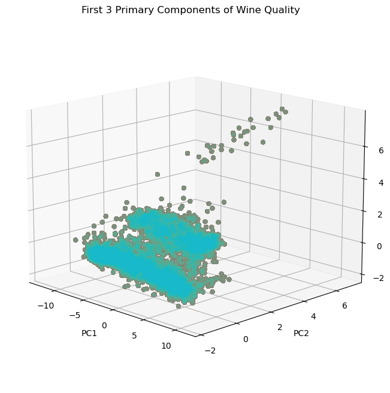

# Principle_Component_Analysis_using_Householder_Reflection

■ Principle Component Analysis is technique for dimensional reduction.

■ It helps in summarizing the dataset which has large number of variables by reducing less affecting variables without loss of significant information.

■ There are many dimensional reduction method but PCA is considered on the most effective method.

■ We have used Householder reflection for QR decomposition.

**Dataset**:

https://www.openml.org/search?type=data&sort=runs&id=40900&status=active


**Analysis**

```python
# Calculating Co-variance Matrix

X_white = (X - mean(X))/std(X)
C = X_white.T @ X_white / (X_white.shape[0] - 1)

# Visualizing Co-variance Matrix

plt.figure(figsize=(6,6))
plt.imshow(C, cmap='binary')
plt.title("Covariance Matrix of Data Set")
plt.xticks(np.arange(0, 36, 2))
plt.yticks(np.arange(0, 36, 2))
plt.colorbar()
```
    

    


```python
# Calculating

pca = PCA(whiten=True)
pca.fit(X)
X_prime = pca.transform(X)
pca.eigenvalues
C_prime = pca.eigenvectors
X_white = (C_prime - mean(C_prime))/std(C_prime)
C_prime = X_white.T @ X_white / (X_white.shape[0] - 1)

# Visualizing Co-Variance Matrix of the Transformed Data

plt.figure(figsize=(6,6))
plt.imshow(C_prime, cmap='binary')
plt.title("Covariance Matrix of Transformed Data")
plt.xticks(np.arange(0, 36, 2))
plt.yticks(np.arange(0, 36, 2))
plt.colorbar()
plt.show()
```
    


```python
# Ploting Eigen Vectors

fig = plt.figure(figsize=(10, 7))
plt.title("Scree Plot (Eigenvalues in Decreasing Order)")
plt.plot([1, 36], [1, 1], color='red', linestyle='--', label="Kaiser Rule")
plt.xticks(np.arange(1, 36, 1))
plt.xlim(1, 36)
plt.ylim(0, 10)
plt.ylabel("Eigenvalue")
plt.xlabel("Principle Component Index")
plt.grid(linestyle='--')
plt.plot(range(1, 37), pca.eigenvalues, label="Eigenvalues")
plt.legend()
plt.show()
```
    


```python
# Variance covered by the Eigen Vectors

fig = plt.figure(figsize=(10, 7))
plt.title("Variance Explained By Component")
plt.xticks(np.arange(1, 36, 1))
plt.yticks(np.arange(0, 1.0001, 0.1))
plt.xlim(1, 35)
plt.ylim(0, 1)
plt.ylabel("Proportion of Variance Explained")
plt.xlabel("Principle Component Index")
plt.grid(linestyle='--')
plt.fill_between(
    range(1, 37),
    np.cumsum(pca.proportion_variance_explained),
    0,
    color="lightblue",
    label="Cumulative")
plt.plot(
    range(1, 37),
    np.cumsum(pca.proportion_variance_explained),
    0,
    color="darkblue")
plt.plot(
    range(1, 37),
    pca.proportion_variance_explained,
    label="Incremental",
    color="orange",
    linestyle="--")
plt.legend(loc='upper left')
plt.show()
```


    

    


```python
# Visualizing Eigen Vectors and Tranformed Data

plt.figure(figsize=(10, 4))
x_data = X.iloc[:,0]
y_data= (pca.eigenvectors[1,0]/pca.eigenvectors[0,0])*X_prime.iloc[:,0]
y_data1= (pca.eigenvectors[1,1]/pca.eigenvectors[0,1])*X_prime.iloc[:,0]
fig = plt.figure(figsize=(10, 10))
for c in np.unique(X):
    X_class = X_prime
    plt.plot(X_prime.iloc[:,0],y_data,color='red')
    plt.plot(X_prime.iloc[:,0],y_data1,color='green')
    plt.scatter(X_class.iloc[:,0],X_class.iloc[:,1],alpha=0.1,color='blue')
plt.title("Primary Components of Space Data")
plt.xlabel("Feature 1")
plt.ylabel("Feature 2")
plt.grid()
plt.show()
```

    

    


```python
# 2D Scatter plot of Tranformed Data

for c in np.unique(X):
    X_class = X_prime
    plt.scatter(X_class.iloc[:, 0], X_class.iloc[:, 1], alpha=0.2)
plt.title("Primary Components of Wine Quality")
plt.xlabel("PC1")
plt.ylabel("PC2")
plt.grid()
plt.show()
```


    

    


```python
# 3D Scatter plot of Tranformed Data

fig = plt.figure(figsize=(10, 8))
ax = fig.add_subplot(111, projection='3d')
ax.view_init(15, -45)
for c in np.unique(X):
    X_class = X_prime
    ax.scatter(X_class.iloc[:, 0], X_class.iloc[:, 2], X_class.iloc[:, 1], alpha=0.2)
plt.title("First 3 Primary Components of Wine Quality")
ax.set_xlabel('PC1')
ax.set_ylabel('PC2')
ax.set_zlabel('PC3')
plt.show()
```


    

    

